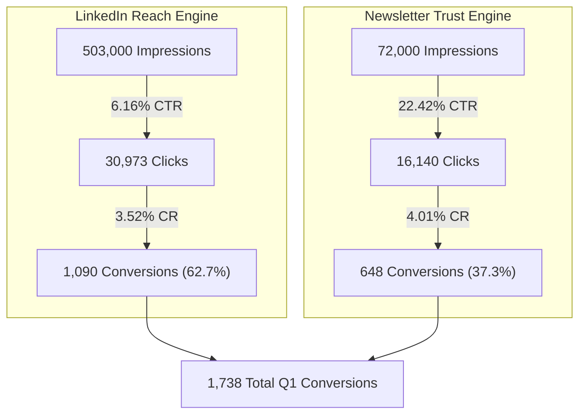

# Sunday Bake Business Review & Marketing Performance Report

This report presents a comprehensive business review of the **Sunday Bake** personal tech brand, analyzing financial metrics from `data/annual_financial_performance.md` and Q1 marketing performance data from `data/marketing_performance.csv`. 

To support presenting these insights to stake-holders, a custom, high-fidelity, interactive HTML slide deck has been compiled and saved as:
👉 [outputs/performance_slides.html](file:///C:/Users/USER/.gemini/antigravity/scratch/sunday_bake_marketing/outputs/performance_slides.html)

---

## 1. Executive Summary

- **Year 3 Revenue:** **$145,000**, representing **52.6% YoY growth** from Year 2 ($95,000).
- **Primary Income Drivers:** Technical Consulting (45%), Premium AI/ML Courses (35%), and Newsletter Sponsorships (20%).
- **Operating Efficiency:** **85% operating margins** sustained through low-overhead digital asset delivery.
- **Q1 Marketing Trajectory:** Total Q1 conversions across LinkedIn and Newsletter scaled from **115 (Year 1)** to **507 (Year 2)**, and reached **1,738 (Year 3)**—a **15.1x overall increase** over two years.

---

## 2. Three-Year Financial Growth Analysis

Gross revenue has scaled steadily across all three core revenue streams. Below is the compiled YoY revenue breakdown:

| Revenue Stream | Year 1 | Year 2 | Year 3 | Share (Y3) | Growth Rate (Y3) |
| :--- | :--- | :--- | :--- | :--- | :--- |
| **Technical Consulting** | $25,000 | $48,000 | $65,000 | 44.8% | +35.4% YoY |
| **Premium AI/ML Courses** | $12,000 | $28,000 | $51,000 | 35.2% | **+82.1% YoY** |
| **Newsletter Sponsorships** | $3,000 | $19,000 | $29,000 | 20.0% | +52.6% YoY |
| **Gross Total** | **$40,000** | **$95,000** | **$145,000** | **100%** | **+52.6% YoY** |

### Key Financial Insights
1. **Course Revenue Acceleration:** Courses have seen the highest growth rate (+82.1% YoY in Year 3), driven by the launch of the *Advanced AI Security* cohort. This indicates high market demand for security-focused AI content.
2. **Consulting as the Core Base:** Technical Consulting remains the largest individual contributor ($65,000), providing a stable foundation of high-value client work.
3. **Newsletter Sponsorship Stabilization:** Sponsorship revenue grew 52.6% in Year 3 as subscription rates reached **25,000 readers**, establishing a highly marketable, recurring channel.

---

## 3. Marketing Channel Performance Analysis (Q1 Audits)

An audit of Q1 performance logs (January–March) for both LinkedIn and Newsletter channels reveals rapid reach and efficiency gains.

### LinkedIn (Reach & Volume Engine)
LinkedIn acts as the primary top-of-funnel reach driver. Click volume expanded significantly, supported by improving Click-Through Rates (CTR) and Conversion Rates (CR):

| Year & Month | Impressions | CTR | Clicks | Conversions | CR |
| :--- | :--- | :--- | :--- | :--- | :--- |
| **Year 1 Q1 Total** | **84,000** | **3.82%** | **3,210** | **68** | **2.12%** |
| **Year 2 Q1 Total** | **217,000** | **4.86%** | **10,541** | **286** | **2.71%** |
| **Year 3 Q1 Total** | **503,000** | **6.16%** | **30,973** | **1,090** | **3.52%** |

- **Growth:** Q1 LinkedIn conversions scaled **16.0x** from Year 1 (68) to Year 3 (1,090).
- **CTR Improvement:** Average CTR increased from 3.82% to 6.16%, proving the resonance of high-signal, developer-focused content.

### Newsletter (High-Intent Conversion Engine)
The Newsletter serves as a high-trust conversion channel, yielding exceptional CTRs and conversion efficiencies:

| Year & Month | Impressions | CTR | Clicks | Conversions | CR |
| :--- | :--- | :--- | :--- | :--- | :--- |
| **Year 1 Q1 Total** | **16,500** | **13.06%** | **2,155** | **47** | **2.18%** |
| **Year 2 Q1 Total** | **42,000** | **17.48%** | **7,340** | **221** | **3.01%** |
| **Year 3 Q1 Total** | **72,000** | **22.42%** | **16,140** | **648** | **4.01%** |

- **CTR Peak:** Newsletter CTR peaked at **24.0%** in March of Year 3.
- **Conversion Rate Peak:** Conversion rate scaled to **4.01%** in Y3, showing that subscribers are highly qualified leads who buy premium courses or consulting services.

---

## 4. Channel Synergy & Funnel Conversion Analysis

Comparing the two channels in Year 3 Q1 highlights how reach volume interacts with engagement trust:



### Funnel Takeaways
- **Reach Volume:** LinkedIn drives **87.5% of total impressions** (503k vs. 72k). It is the essential top-of-funnel engine.
- **Engagement Efficiency:** The Newsletter has **3.6x higher CTR** (22.42% vs. 6.16%) and **14% higher Conversion Rate** (4.01% vs. 3.52%). It is the primary high-trust revenue closer.
- **Integrated Funnel Strategy:** Organic reach from LinkedIn should continue to be funneled into Newsletter subscriptions, which then systematically convert readers to premium courses.

---

## 5. Slide Deck Structure & Interactive Features

The generated slide deck `outputs/performance_slides.html` is a premium, single-page web presentation styled with a dark developer theme (`#121212` background, neon cyan, terminal green, and electric blue highlights) matching the brand guidelines.

### Slide List
1. **Slide 1: System Initialized (Cover)** - Overview of brand audit, terminal-shell logs, and primary Year 3 key metrics.
2. **Slide 2: Brand Identity & Developer Positioning** - Focus pillars (DevSecOps + AI) and interactive audience persona terminal.
3. **Slide 3: Three-Year Revenue Trajectory** - YoY financial table and interactive SVG chart (Combined Streams / Shares / Table modes).
4. **Slide 4: LinkedIn Channel Expansion** - Q1 LinkedIn scaling metrics and interactive SVG column charts for Impressions/Clicks/Conversions.
5. **Slide 5: Newsletter Channel Performance** - Q1 Newsletter engagement scaling and interactive SVG column charts.
6. **Slide 6: Channel Synergy & Funnel Conversion** - Side-by-side comparison of LinkedIn and Newsletter conversion funnels.
7. **Slide 7: Technical Brand Visual System** - Image gallery embedding real-time marketing visual assets (`rag_architecture.png`, `devsecops_pipeline.png`, `llm_security.png`).
8. **Slide 8: Strategic Action Playbook** - SOP workflows, Q&A section, and Year 4 milestones.

### Premium Interactive Features
- **Keyboard Navigation:** Use `ArrowRight`, `ArrowLeft`, or `Spacebar` to navigate seamlessly.
- **Slide Indicators & Controls:** Navigation dots showing current progress, clickable previous/next buttons, and slide counter.
- **Autoplay Slideshow:** Click the play/pause button in the footer to cycle slides automatically every 5 seconds.
- **Interactive SVG Charts:** Clean, vector charts built inline with custom hover states and an overlay tooltip showing exact numbers.
- **CSV Data Viewer:** Click the file icon in the footer to open a modal displaying the raw `marketing_performance.csv` data.

---

## 6. Slide Deck Screenshots

Below are screenshots of the generated presentation displaying the layout, styling, and charts:

````carousel

<!-- slide -->

<!-- slide -->

````

---

## 7. Key Strategic Takeaways & Year 4 Recommendations

> [!NOTE]
> Strategic recommendations are grounded directly in the financial reports and marketing logs.

1. **Cohort-based Expansion:** Given Course sales have seen the highest growth rate (+82% YoY), launch a new cohort-based course on *Secure LLM Architecture Design* to capitalize on course popularity.
2. **Audience Funnel Optimization:** Optimize LinkedIn posts to drive newsletters signups. Implement an SOP to offer free cheatsheets (like the *RAG System Architecture Map*) on LinkedIn in exchange for newsletter signup, moving top-of-funnel impressions to high-trust conversion leads.
3. **Protect Operating Margins:** Safeguard the 85% operating margins by continuing to prioritize digital delivery models over high-overhead consulting, transitioning consulting offerings toward packaged architectural advisory templates.
